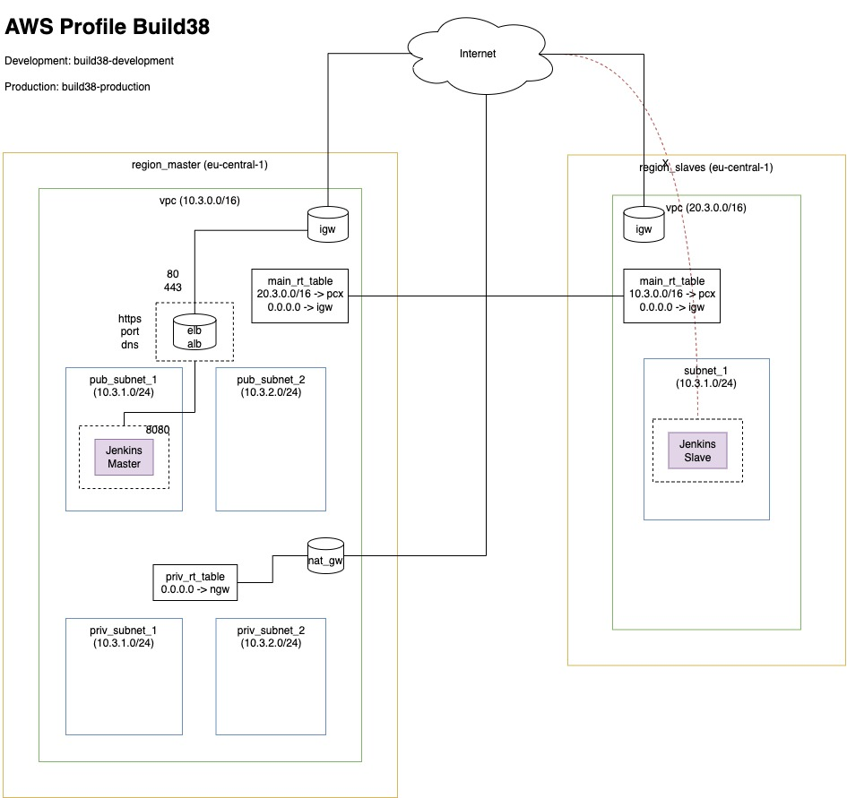

# Deploying Jenkins Infrastructure with Terraform + Ansible on top AWS

## Jenkins



## Pre requite

- Build38 AWS Access
- Tools `terraform` + `ansible` properly installed
- Build38 VPN Connection

## Deploy infra with terraform && configure jenkins with ansible

1. Init terraform backend
```
make jenkins/init
```

2. Deploy
```
make jenkins/apply
```
